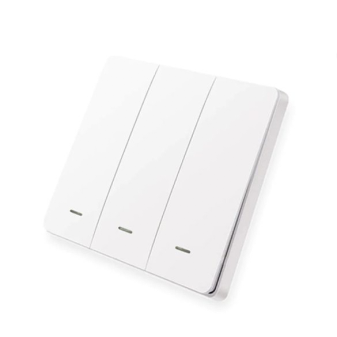

# The Home office automation project

## Hardware Used
1. ESP32 Dev Board
1. PN532 RFID Scanner
1. WS2812B RGB LED Module
1. W5500 Ethernet Network Module
1. PIR Motion Sensor HC-SR501
1. ESP32-C3 Super-Mini
1. ESP32 Relay Array Board
1. Zigbee Dongle-P (CC2652P)
1. Tuya Zigbee RGBCW A60 A70 E27 Bulb
1. Tuya Zigbee Scene Switch 3 Gang

## Software Used
1. Node-Red version 3.1
2. Arduino IDE version 2.2.1
1. MongoDB version 7.0.2
1. HomeKit (iPad OS version 17.2.3)
1. PlatformIO version 6.1.11
1. Ubuntu Server Version 22.04.3
1. Mosquitto MQTT version 2.0.18
1. Zigbee2MQTT version 1.33.1

Here's that plan of this project  

     
    Project Diagram

## Overview
In this project there consists of 5 parts that are works together.

1. Node-RED  
Node-RED is a Open Source Low-Code platform written in Javascript which is run as a backend for the whole project. It's also connects to the database like `influxdb` to store and get query the data of the rfid module and then Node-RED is also connected to Zigbee2MQTT service through MQTT to expand the possibility of available devices.

     
    Node-RED Flows

2. ESP32 Relay board  
This board is connected to the same WiFi network as the Node-RED and communicate with Node-RED through web-socket protocol. This board is powered by normal 5V power supply and be able to control 6 relays through web-socket command.

     
    Relay Board

3. Zigbee Devices  
These device connect to Node-RED by a dongle which forward the message to the MQTT broker through Zigbee2MQTT. Zigbee2MQTT also has it's own web interface so that we can config.

     
Zigbee Dongle

     
    3 Gang Switch

4. Motion Detector  
This device operates by sensing the motion sensor and and sends it to the <a href="#more-about-mqtt">MQTT</a> broker

     
    Motion Detector Module

5. Apple Homekit  
Node-RED has module called <a href="https://flows.nodered.org/node/node-red-contrib-homekit-bridged"> <code>node-red-contrib-homekit-bridged</code> </a> which are capable of connecting Node-RED to Apple HomeKit app (as a bridge or a device) to connect the device to HomeKit through Node-RED

     
    HomeKit App interface with devices

## More about MQTT

MQTT in simple term is like a chat server for IOT devices. There are 2 main types of operations that MQTT provides. Each are based on something called "Topic" which is like a chat room we're in when someone send some message to the topic everyone recieves and vise-versa. All operations are done through a broker which we can host ourselves or use publicly provided one.

The two operations mentioned earlier are called "Publish" and "Subscribe", the device which wants to send the message will "Publish" the data to the "Topic" and then the devices that are "Subscribe" to that topic will recieves it like shown in below diagram by HiveMQ which is an MQTT broker.

     
    MQTT Working Diagram

